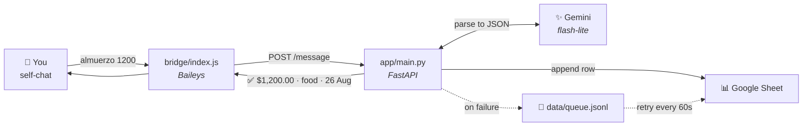
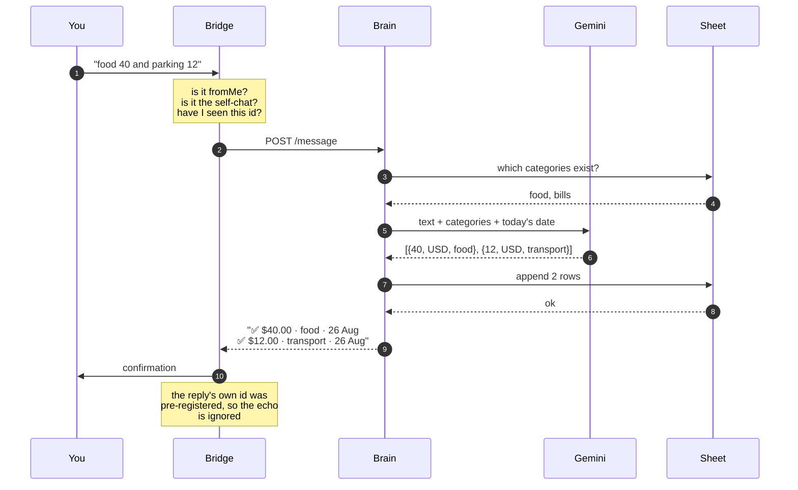

# Personal expense log bot

You message yourself on WhatsApp, it lands in a Google Sheet.

Two processes:

- **`bridge/`** (Node) — Baileys client. Owns the WhatsApp session, filters
  messages, forwards them over localhost, sends the reply back.
- **`app/`** (Python) — the brain. Gemini parses the text, the row goes to
  Sheets, the reply text comes back.

The bridge holds no logic and the brain knows nothing about WhatsApp, so you can
`curl` the brain to test everything without touching your phone.

## How it works



Every message takes the same path. The important part is the **order**: the
confirmation is sent *after* the sheet write returns, never before, so a ✅ in
your chat always means the row is really there.



### What happens to one message

| Stage | What it does | If it fails |
|---|---|---|
| **Filter** | Drops anything not sent by you in your self-chat, and any message id already handled | Silent, but logged with the reason |
| **Categories** | Reads the distinct values already in the sheet | Falls back to `SEED_CATEGORIES` |
| **Parse** | Gemini returns strict JSON: amount, currency, category, description, absolute date | Retries 1s/2s/4s/8s across two models, then says the parser is down |
| **Validate** | Rejects non-positive amounts, snaps categories to existing spellings, defaults bad dates to today | Bad entries dropped, not guessed |
| **Write** | One `append` call for all rows from that message | 3 tries, then queued to disk and retried every 60s |
| **Confirm** | Only now is ✅ sent | Plain failure message, no ✅ |

### Why two processes

Baileys is Node-only; the logic is Python. Splitting them means the WhatsApp
session can restart without touching the parser, and the whole pipeline is
testable over HTTP:

```bash
curl -XPOST localhost:8000/message -H 'content-type: application/json' \
  -H "x-bridge-token: $BRIDGE_TOKEN" \
  -d '{"message_id":"1","chat_jid":"test","text":"almuerzo 1200"}'
```

## Setup

### 1. Dependencies

```bash
npm install
python3 -m venv .venv && .venv/bin/pip install -r requirements.txt
```

### 2. Google Sheet

Create a sheet with a tab named `Log`. The header row is written automatically
on first start:

| Column | Holds | Shown as |
|---|---|---|
| `timestamp` | when the row was written, ISO 8601 with offset | `2026-08-26T23:23:22+09:00` |
| `date` | the expense date, after relative dates are resolved | `08-25-2026` |
| `amount` | a number, not text — so `SUM` works | `4.5` |
| `currency` | ISO code | `USD` |
| `category` | learned from this column, see below | `food` |
| `description` | short, in your original language | `almuerzo` |
| `raw_message` | exactly what you typed | `almuerzo 1200` |

The two date columns are deliberately different:

- **`timestamp`** is a full ISO 8601 string with a UTC offset, stored as text.
  Sheets cannot parse an offset, and that is the point — it records the exact
  instant unambiguously, whatever the sheet's own locale and timezone are.
- **`date`** is a *real date value* carrying a `mm-dd-yyyy` display pattern, not
  a string. It has to stay a date so it sorts correctly and so `total` can
  filter by month; only its appearance is `08-25-2026`.

Both formats are reapplied on every start, so they survive manual edits.
Rename the headers to whatever you like — the code depends on column *order*,
never on the header text.

Then in Google Cloud: enable the **Google Sheets API**, create a **service
account**, download its JSON key, and **share the sheet with the service
account's email as Editor**. That last step is the one people forget — without
it every write returns 403.

### 3. Gemini key

From <https://aistudio.google.com/apikey>. The free tier covers this easily.

Two models are configured, and the second is tried early rather than last:

```
GEMINI_MODEL=gemini-3.1-flash-lite            # primary
GEMINI_FALLBACK_MODEL=gemini-3.5-flash-lite   # tried after 1s if the primary fails
```

This is not belt-and-braces. Individual models go slow or unavailable for hours
at a time — `gemini-3.5-flash-lite` was answering in 18s while `3.1` answered
the same prompt in 1.9s — and an overloaded model stays overloaded, so switching
beats waiting. A parse normally takes ~1-2s end to end.

Two gotchas worth knowing:

- `GEMINI_TIMEOUT_MS` below **10000** makes every call fail with a `400`
  (`deadline is too short`). The config clamps it, so you cannot set it lower.
- `gemini-2.5-flash-lite` returns `404 — no longer available to new users` for
  recently created keys.

To see what your key can actually reach:

```bash
.venv/bin/python -c "
from app import config
from google import genai
for m in genai.Client(api_key=config.GEMINI_API_KEY).models.list():
    if 'generateContent' in (m.supported_actions or []): print(m.name)
"
```

### 4. `.env`

```bash
cp .env.example .env
openssl rand -hex 24   # paste into BRIDGE_TOKEN
```

Fill in `GEMINI_API_KEY`, `SHEET_ID`, `GOOGLE_SERVICE_ACCOUNT_EMAIL` and
`GOOGLE_PRIVATE_KEY` (one line, keep the literal `\n` sequences), then set `TZ`
and `DEFAULT_CURRENCY` to yours.

### 5. Run

```bash
.venv/bin/python -m app.main     # terminal 1
npm start                        # terminal 2 — prints a QR
```

Scan the QR from **WhatsApp → Linked devices**. The session persists to `auth/`,
so restarts do not need a new scan.

> Use a spare number. Baileys drives WhatsApp Web unofficially; the ban risk for
> personal-volume use is low but not zero.

Check the brain on its own at any time:

```bash
curl localhost:8000/health
curl -XPOST localhost:8000/message -H 'content-type: application/json' \
  -H "x-bridge-token: $BRIDGE_TOKEN" \
  -d '{"message_id":"1","chat_jid":"test","text":"almuerzo 1200"}'
```

### 6. Keep it running

```bash
npm i -g pm2
pm2 start ecosystem.config.cjs
pm2 save && pm2 startup
```

## One number or two

WhatsApp draws a bubble green-and-right when the message is `fromMe`, and
white-and-left when it is not. That is decided by *who sent it*, and no API or
formatting can override it. Which means the two setups look different:

| | `BOT_MODE=self` | `BOT_MODE=dedicated` |
|---|---|---|
| Numbers needed | one — yours | two — yours and the bot's |
| Where you type | your own "Message yourself" chat | a normal chat with the bot's number |
| How replies look | green, right-aligned, identical to your messages | **white, left-aligned** |
| Telling them apart | only by the quoted block on replies | obvious — they are incoming |
| Who may use it | you, in your own chat | whoever is in `ALLOWED_CHAT_JIDS` |

`self` is the default and needs no second SIM. Choose `dedicated` if the
green-on-green is the thing that bothers you.

### Switching to a dedicated number

1. Link the bridge to the **bot's** number, not yours:
   `./stop.sh && rm -rf auth data/seen.json && npm start`, then scan with the
   phone that will *be* the bot.
2. Set `BOT_MODE=dedicated` in `.env`.
3. From your personal phone, message the bot's number once. The bridge log
   prints `ignored: message from <jid>` — that jid is yours.
4. Put it in `ALLOWED_CHAT_JIDS` (a bare number like `18158006148` also works)
   and `./start.sh`.

Anyone not on that list is ignored, so the number being reachable does not make
your log writable by strangers.

## Linking a different phone

One WhatsApp number per session — to move the bot to another phone you replace
the session rather than adding one:

```bash
./stop.sh
cp -r auth auth-backup-$(date +%F)   # so you can go back
rm -rf auth data/seen.json
npm start                            # live QR, refreshes every ~20s
```

Scan from **WhatsApp → Linked devices** on the new phone, then Ctrl-C and
`./start.sh` to run it in the background. `./qr.sh` prints the newest QR if the
bridge is already running in the background.

To go back to the old number: `rm -rf auth && mv auth-backup-<date> auth`.

The bot follows whichever number is linked, and `ALLOWED_CHAT_JIDS` is empty by
default, so it listens to the new number's self-chat with no further config.

## Start / stop

```bash
./start.sh    # brings up both processes, waits until each is actually ready
./stop.sh     # stops both, keeps the WhatsApp session
./status.sh   # is it healthy?
```

`start.sh` is idempotent — running it twice will not spawn a second bridge.
`stop.sh` leaves `auth/` alone, so starting again needs no new QR scan.

## Is it running?

```bash
./status.sh
```

Checks both processes, the session state, queued writes and recent activity,
and tells you the command to fix whatever is down.

**Run exactly one bridge.** Two instances kick each other off the WhatsApp
session every few seconds (`connection closed 440`) and neither stays up long
enough to read a message. The bridge now refuses to start if another one holds
`data/bridge.pid`, and exits rather than fighting back if it gets replaced.

## Using it

Message **yourself** (WhatsApp → search your own name → "Message yourself").
Anything you type in another chat is ignored unless you list that chat's JID in
`ALLOWED_CHAT_JIDS`; messages from other people are never accepted, anywhere.

```
almuerzo 1200            →  ✅ ¥1,200 · food · 26 Aug
taxi 3500 ayer           →  ✅ ¥3,500 · transport · 25 Aug
food 40 and parking 12   →  ✅ ¥40 · food · 26 Aug
                            ✅ ¥12 · transport · 26 Aug
coffee                   →  ❓ How much was the coffee?
480                      →  ✅ ¥480 · food · 26 Aug
```

Relative dates work in any language — "yesterday", "ayer", "昨日" — because the
model is handed today's date and returns an absolute one.

| Command | Does |
|---|---|
| `undo` | Removes the rows the last logged message produced |
| `total` | This month, with a per-category breakdown |
| `total food` | This month, one category |
| `clean` | Deletes every data row, keeps the header |
| `help` | The above, plus the categories in use |

`clean` writes `data/sheet-backup-<timestamp>.json` before deleting, and the
sheet's own File → Version history is a second net.

## Categories

Learned from the sheet, not fixed. Before each parse the bot reads the distinct
values in the `categoría` column and hands them to the model, which reuses one
when it fits and coins a new one when nothing does:

```
lunch 12            -> food        (reused)
rent 900            -> rent        (new)
vet for the dog 65  -> pets        (new)
```

`SEED_CATEGORIES` in `app/config.py` only bootstraps an empty sheet.

The risk of a learned list is drift — `food`, `Food` and `comida` splitting one
category three ways. `gemini._clean_category` limits it: the model is told not
to coin near-duplicates, new names are lowercased and trimmed, anything already
present is snapped to its existing spelling, and anything longer than two words
falls back to `other`. It reduces drift; it does not eliminate it. If your
totals start fragmenting, edit the column in the sheet and the bot follows —
the sheet is the source of truth.

The list is cached for `CATEGORY_CACHE_SECONDS` (60 by default) and invalidated
on every write, so a new category is visible to the next message.

## When things fail

| Failure | What happens |
|---|---|
| Gemini 429 | Retries at 1s, 2s, 4s, 8s. Bad requests fail immediately instead of burning the backoff |
| Sheets write fails | 3 tries, then the rows go to `data/queue.jsonl` and a flusher retries every `QUEUE_FLUSH_MS`. **No ✅ is sent** — the reply says it is queued |
| Brain down | The bridge replies that the parser is down; nothing is logged |
| Anything else | Caught in `/message`; the process stays up |

Every message, parse result and write lands in `data/bot.jsonl`, one JSON object
per line. When a parse looks wrong, that file plus the `raw_message` column in
the sheet is enough to reconstruct what happened:

```bash
tail -f data/bot.jsonl | jq .
```

## Out of scope

Charts, dashboards, receipt photos, voice notes, budgets, recurring expenses,
currency conversion. Totals are reported per currency rather than converted.

## Layout

```
bridge/index.js      Baileys socket, message filter, reply sender
app/main.py          FastAPI endpoint + queue flusher
app/handlers.py      command routing, the log-an-expense flow
app/gemini.py        prompt, response schema, backoff, validation
app/sheets.py        append / read / delete via a service account
app/store.py         jsonl log, retry queue, undo pointer, pending asks
app/fmt_helpers.py   money and date formatting for replies
app/config.py        env loading, the category list
```
